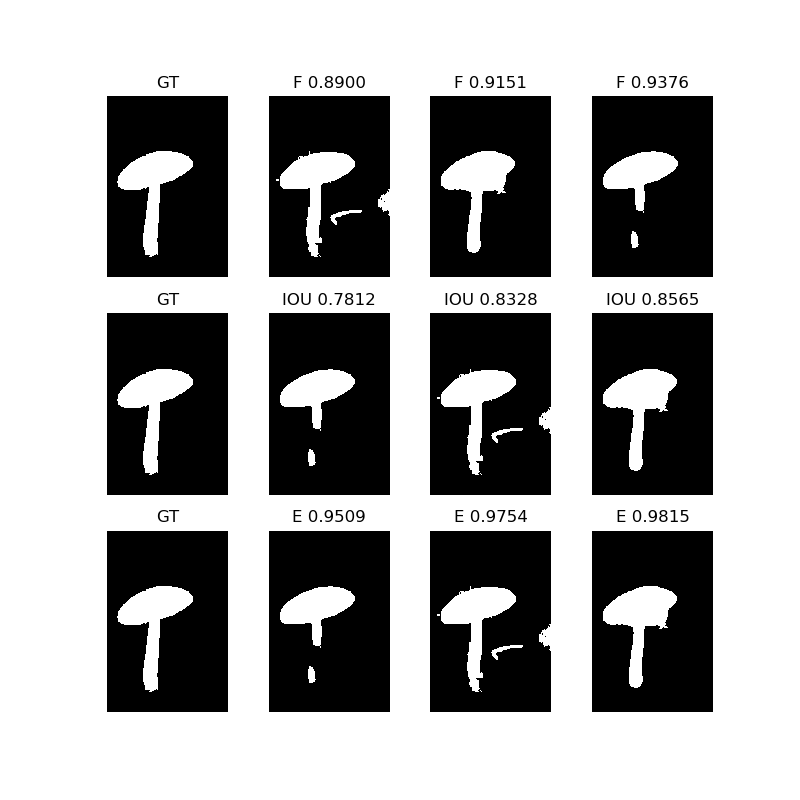
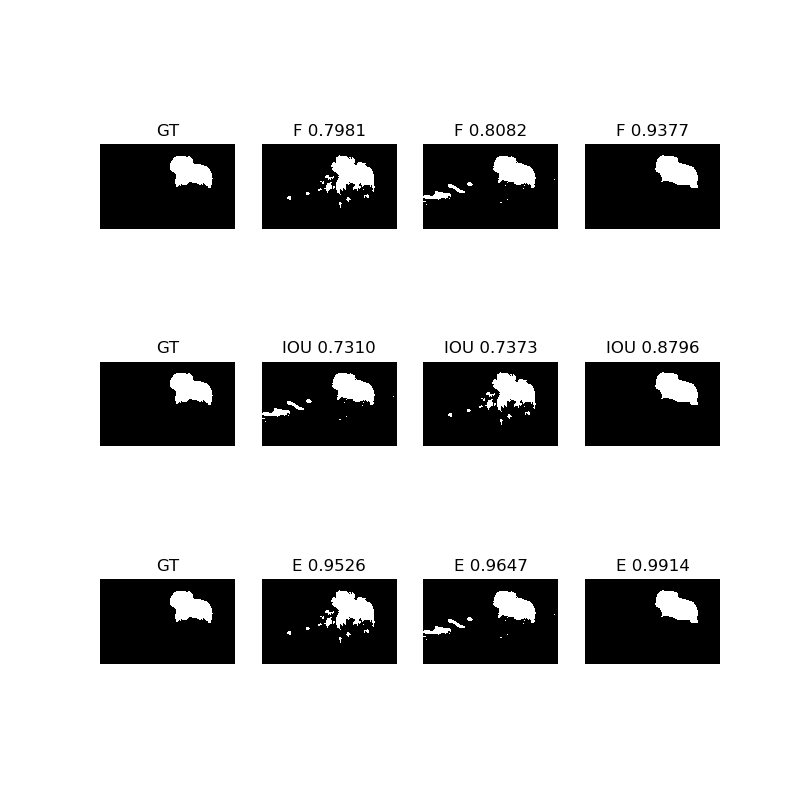

# Enhanced-Alignment-Measure

> Author: Yuchao Gu

> E-mail: 2015014178@buct.edu.cn

> Date: 2018-08-07

> Description: my python implementation of paper 《Enhanced-alignment Measure for Binary Foreground Map Evaluation》IJCAI 2018 based on origin [matlab code](https://github.com/DengPingFan/E-measure)

## usage
	git clone https://github.com/guyuchao/SegMeasure.git
	cd E-measure/
	python E_measure.py
	!!!you can find result in FMDatabase/result!!!

## what's new
* Except Enhanced-Alignment-Measure, IOU and F-measure are also implemented
* I use the [FMdataset](http://dpfan.net/wp-content/uploads/FMDatabase.zip) mentioned in the paper.

## enviroment
* windows 10
* python2.7

## visual result

