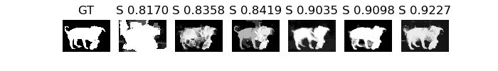

# Structure-Measure

> Author: Yuchao Gu

> E-mail: 2015014178@buct.edu.cn

> Date: 2018-08-07

> Description: my python implementation of paper 《Structure-measure: A New Way to Evaluate Foreground Maps》ICCV 2017 based on origin [matlab code](https://github.com/DengPingFan/S-measure)

## usage
	git clone https://github.com/guyuchao/SegMeasure.git
	cd S-measure/
	python S_measure.py
	!!!you can find result in demo/result!!!
	
## evaluate your result
#### This method is used to evaluate non-binary result and binary ground truth, make sure your prediction is non-binary and ground truth is binary

## enviroment
* windows 10
* python2.7

## visual result

